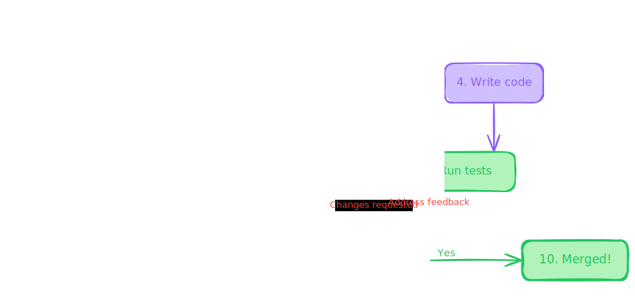

# AQIMO — AQI Prediction & Real-Time Safety Advisory System
<p align="left">
  
  
  
  
</p>

---

## Overview


AQIMO is a research-backed, end-to-end environmental intelligence platform that bridges live air quality data with machine learning-based AQI prediction inside a single deployable web application.

The platform operates across two complementary data flows: a city-driven live AQI feed powered by the WAQI API (World Air Quality Index — WHO-standard data), and an ML prediction engine trained on 420,768 hourly records that estimates PM2.5 concentration from raw pollutant inputs. Both flows surface results through a purpose-built React + TypeScript SPA — no backend proxy, no intermediary layer — keeping the architecture lean and the data path transparent.

A third module, the Particle Visualiser, provides an interactive Brownian motion simulation across five pollutants, allowing users to understand the physical scale and health risk of what the numbers represent — closing the gap between raw AQI data and environmental intuition.

---

## Live Demo

- **Frontend:** [https://celadon-choux-9b742a.netlify.app](https://celadon-choux-9b742a.netlify.app)
- **Research deployment (Flask):** [https://aqimonitoring.lovable.app](https://aqimonitoring.lovable.app/about)

---

## ML Model Performance

Three regression models were evaluated on the **Beijing Multi-Site Air Quality Dataset** (UCI/Kaggle) — 420,768 hourly records across 12 monitoring stations (March 2013 – February 2017). The Aotizhongxin station subset (35,064 records) was used for PM2.5 regression. An 80/20 train-test split (`random_state=42`) produced 28,051 training and 7,013 test samples.

| Model | R² | RMSE | MAE | Notes |
|---|---|---|---|---|
| Linear Regression | 0.8611 | 30.39 | 20.14 | Baseline — ~86% PM2.5 variance explained |
| Gradient Boosting | 0.9282 | 21.84 | 14.39 | Sequential residual correction |
| **Random Forest** ✓ | **0.9486** | **18.48** | **11.36** | **Best — 39.2% RMSE reduction vs baseline** |

> Random Forest (100 estimators, `random_state=42`) outperformed both competing models across all metrics. The 39.2% RMSE reduction over Linear Regression confirms the advantage of nonlinear ensemble modeling on multi-pollutant atmospheric data.

### AQI Classification Model

A separate **Random Forest Classifier** trained on the Global AQI Classification Dataset (Kaggle, 24,555 records after cleaning) achieved **99.98% testing accuracy** across six WHO/EPA-defined AQI categories. Note: the high accuracy reflects the deterministic nature of AQI Status as a threshold function of AQI Value — this is a structural property of the EPA/WHO AQI scale, not a data leakage artifact.

### Feature Importance (Random Forest Regressor)

| Feature | Importance | Rank | Interpretation |
|---|---|---|---|
| PM10 | 0.7963 | 1st | Shared emission sources with PM2.5 (combustion, road dust) |
| CO | 0.1052 | 2nd | Combustion byproduct co-emitted with particulates |
| DEWP | 0.0241 | 3rd | Atmospheric moisture affects particle dispersion |
| SO2 | 0.0198 | 4th | Industrial emission co-predictor |
| NO2 | 0.0145 | 5th | Traffic emission marker |
| Others (7) | 0.0401 | 6–12th | TEMP, PRES, RAIN, WSPM, O3, Month, Hour |

PM10's dominant importance (0.7963) is physically interpretable — PM10 and PM2.5 are particulate fractions sharing common emission sources including combustion, industrial activity, and road dust resuspension.

### Temporal Analysis (Beijing Dataset)

- **Seasonal:** December peak monthly average PM2.5 (~110 μg/m³) vs August minimum (~57 μg/m³) — driven by winter coal heating and reduced atmospheric dispersion.
- **Diurnal:** PM2.5 peaks at 0–2 AM (~92.5 μg/m³), reaches minimum at 3–4 PM (~76.5 μg/m³) — consistent with nighttime temperature inversions suppressing vertical mixing.

---

## Datasets

| Dataset | Source | Records | Purpose |
|---|---|---|---|
| Global AQI Classification | Kaggle | 24,555 (after cleaning) | AQI status classification model |
| Beijing Multi-Site Air Quality | UCI / Kaggle | 420,768 hourly (35,064 subset) | PM2.5 regression — 12 features, 12 stations, 2013–2017 |

**12 features used for regression:** PM10, SO2, NO2, CO, O3, TEMP, PRES, DEWP, RAIN, WSPM, Month, Hour.

**Preprocessing:** Wind direction, station, and index columns dropped. Missing values removed via `dropna()` — 7,271 null entries eliminated, yielding 31,815 clean records. Label encoding applied to categorical columns.

---

## Project Architecture

AQIMO is structured as a two-module monorepo — a React frontend and a self-contained ML training environment — with no shared runtime dependency between them. The frontend consumes trained model output via client-side inference; the ML module exists purely for training, evaluation, and export.

```text
AQIMO/
│
├── frontend/                        # React + TypeScript SPA
│   ├── public/                      # Static assets
│   ├── src/
│   │   ├── components/              # Reusable UI components
│   │   ├── hooks/                   # Custom React hooks (data-fetching, state)
│   │   ├── lib/                     # Utilities, WAQI API client
│   │   ├── pages/                   # Route-level components: Home, About, Particles
│   │   ├── test/                    # Vitest unit and integration tests
│   │   ├── app.tsx                  # Root application component
│   │   ├── main.tsx                 # Entry point — ReactDOM.createRoot
│   │   └── vite-env.d.ts            # Vite environment type declarations
│   │
│   ├── index.html                   # SPA shell
│   ├── vite.config.ts               # Vite build configuration
│   ├── vitest.config.ts             # Vitest test runner (decoupled from build)
│   ├── tailwind.config.ts           # Tailwind CSS configuration
│   ├── components.json              # ShadCN UI component registry
│   ├── tsconfig.json / tsconfig.app.json / tsconfig.node.json
│   ├── eslint.config.js
│   ├── package.json
│   └── .env.example                 # ← Required: VITE_WAQI_API_KEY=your_key_here
│
├── ML_model/                        # Training and experimentation — Python
│   ├── waqi_global_aqi_dataset.csv  # Global AQI classification dataset (Kaggle)
│   ├── beijing_airquality_aotizhongxin.csv  # Beijing Multi-Site subset (UCI)
│   ├── aqi_training_pipeline.ipynb  # End-to-end training notebook
│   └── requirements.txt             # Pinned Python dependencies
│
├── LICENSE                          # MIT
└── README.md
```
## 📐 System Architecture

> [  ](https://excalidraw.com/#json=7Pk0xqscY0I0eBtYreQJT,6JiR1JERdXHPhVZxZISLGQ)
```text
Environmental Data Sources
            ↓
     Data Processing Layer
            ↓
      AQI Analytics Engine
            ↓
 Visualization & Dashboard
            ↓
   Real-Time User Interface
```

### Module responsibilities

**`frontend/src/lib/`** — Houses the WAQI API client. City/location selection triggers a direct fetch to `api.waqi.info` — no backend proxy. API key loaded from environment via `import.meta.env.VITE_WAQI_API_KEY`.

**`frontend/src/pages/`** — Three route-level components: `Home` (live WAQI feed + ML prediction engine), `About`, and `Particles` (Brownian motion visualiser).

**`frontend/src/hooks/`** — Custom hooks isolate data-fetching and local state from presentational components — keeping pages thin and testable.

**`frontend/src/test/`** — Vitest-based test suite, configured separately in `vitest.config.ts` to decouple test and build concerns.

**`ML_model/`** — Fully self-contained. The notebook covers data ingestion, preprocessing, feature engineering, three-model comparative training, evaluation, and export. No runtime coupling to the frontend.

---

## Features

### Live AQI engine (Home — live feed)
- City/location selector triggers real-time WAQI API fetch (client-side, no proxy)
- Returns current AQI mapped to six WHO/EPA-standard risk tiers
- Result displayed directly — raw pollutant breakdown intentionally abstracted from the user
- Automatic browser geolocation support
- 

### ML prediction engine (Home — inference path)
- Multi-field pollutant input: PM2.5, PM10, NO₂, CO, SO₂ (mg/m³)
- Random Forest model inference on user-supplied concentration values
- 
- Predicted AQI classified across four risk tiers: Good (0–50) / Moderate (51–100) / Poor (101–200) / Hazardous (201+)
- Contextual control strategy recommendations: Source Control, Improved Ventilation, Air Filtration, Smarter Exposure Choices

### Particle visualiser (Particles page)
- Real-time Brownian motion simulation across PM2.5, PM10, NO₂, CO, SO₂
- Continuous magnification slider: 1× → 1000×
- Microscope Mode for structural particle detail
- Side-by-side diffusion comparison between any two pollutants
- Per-pollutant panel: micro-scale size (μm), health impact rating, emission source tags
- 

### UI
- Dark space-themed aesthetic with animated Earth globe
- Light / dark mode toggle
- Three-page SPA: Home · About · Particles
- Stack: React · TypeScript · Vite · Tailwind CSS · ShadCN UI

---

## Tech Stack

### Frontend

| Technology | Badge |
| :--- | :--- |
| **React** |  |
| **TypeScript** |  |
| **Vite** |  |
| **Tailwind CSS** |  |
| **ShadCN UI** |  |

### Machine Learning

| Technology | Badge |
| :--- | :--- |
| **Python** |  |
| **Pandas** |  |
| **NumPy** |  |
| **Scikit-Learn** |  |
| **Matplotlib** |  |

### Data

| Source | Purpose |
| :--- | :--- |
| **WAQI API** (api.waqi.info) | Real-time city-level AQI — WHO-standard dataset |
| **Beijing Multi-Site Air Quality Dataset** (UCI) | PM2.5 regression training — 420,768 hourly records |
| **Global AQI Classification Dataset** (Kaggle) | AQI classification training — 24,555 records |

---

## Installation

### Prerequisites
- Node.js 18+ or Bun
- Python 3.8+
- WAQI API key — free at [aqicn.org/api](https://aqicn.org/api/)

### Frontend setup

```bash
# Clone the repository
git clone https://github.com/HariKumar-DS/aqimo.git
cd aqimo/frontend

# Install dependencies
npm install
# or: bun install

# Configure environment
cp .env.example .env
# Edit .env and set: VITE_WAQI_API_KEY=your_key_here

# Start development server
npm run dev

# Run tests
npm run test

# Production build
npm run build
```

### ML model setup

```bash
cd aqimo/ML_model

# Install Python dependencies
pip install -r requirements.txt

# Launch training notebook
jupyter notebook aqi_training_pipeline.ipynb
```

### Environment variables

```bash
# frontend/.env  (never commit this file)
VITE_WAQI_API_KEY=your_waqi_api_key_here
```

> The WAQI API key is loaded client-side via `import.meta.env.VITE_WAQI_API_KEY`. Never hardcode it in source. The `.env` file is gitignored — use `.env.example` as the template.

---

## Architectural decisions

**Why WAQI over OpenAQ?**
WAQI provides city-name and geolocation-based lookup in a single API call, returning a pre-computed AQI value directly. OpenAQ returns raw pollutant concentration records that require AQI computation client-side. For a user-facing application where the goal is displaying a single interpretable number, WAQI's response shape is the correct fit.

**Why client-side inference?**
The trained Random Forest model is lightweight enough for client-side execution. Serving it via a backend endpoint would introduce infrastructure overhead (cold starts, latency, deployment cost) disproportionate to the scale of this project. The tradeoff — API key exposed in the browser network tab — is documented and mitigated via environment variable gating. A backend proxy is listed as a future improvement.

**Why Random Forest over Gradient Boosting?**
Gradient Boosting achieved R² = 0.9282 vs Random Forest's 0.9486, and showed greater sensitivity to noise (RMSE 21.84 vs 18.48). For a PM2.5 prediction task on atmospheric data with inherent measurement noise, Random Forest's bagging approach produces more stable predictions. The 39.2% RMSE improvement over the linear baseline validates the ensemble approach.

**Why two separate data flows?**
The live WAQI feed and the ML prediction engine serve distinct user intents. The live feed answers "what is the air quality right now where I am?" The ML engine answers "given these pollutant concentrations, what AQI would result?" Coupling them would constrain both — the ML engine needs to accept arbitrary concentration inputs that may not correspond to any real location or current reading.

---

## Future work

- LSTM-based 24-hour ahead AQI forecasting
- Backend proxy for WAQI API (removes client-side key exposure)
- Model served as a REST inference endpoint (FastAPI)
- Multi-city spatial prediction with geographic interpolation
- Cloud deployment (AWS / GCP) for global scalability
- Multilingual interface for South Asian accessibility
- IoT sensor mesh ingestion via MQTT

---

# Contributing



> [!TIP]
> [  ](https://excalidraw.com/#json=7Pk0xqscY0I0eBtYreQJT,6JiR1JERdXHPhVZxZISLGQ)
Contributions, improvements, and feature suggestions are welcome.

```bash
Fork → Develop → Commit → Pull Request
```

---

## License

[](https://opensource.org/licenses/MIT)

This project is licensed under the MIT License.

---

## Author

**Hari Kumar** 
Bachelor of Computer Applications
Baba Banda Singh Bahadur Engineering College, Fatehgarh Sahib, Punjab

- GitHub: [HariKumar-DS](https://github.com/HariKumar-DS)
- Email: divakarbabu177@gmail.com
- Research guide: Shabad Kaur, Assistant Professor, Dept. of CSE

---

## References

1. Saxena, A. et al. (2022). Research on Air Quality Index: A Comparative Study. *IJRES*, 10(5), 26–34.
2. Sharma, P. et al. (2020). Forecasting AQI using an improved LSTM model. *Int. J. Environmental Science and Technology*, 17(4).
3. Zhang, Y. et al. (2012). Real-time air quality forecasting: History, techniques, current status. *Atmospheric Environment*, 60.
4. Bai, L. et al. (2018). Air pollution forecasts: An overview. *Int. J. Environmental Research and Public Health*, 15(4).
5. World Air Quality Index Project. WAQI API Documentation. https://aqicn.org/api/ [Accessed: April 2026].
6. UCI Machine Learning Repository. Beijing Multi-Site Air Quality Data Set. https://archive.ics.uci.edu/dataset/501 [Accessed: April 2026].
7. US EPA. Technical Assistance Document for the Reporting of Daily Air Quality. EPA-454/B-18-007. 2018.
8. World Health Organization. WHO Global Air Quality Guidelines. Geneva: WHO, 2021.
---
## If this research project helped you or inspired your work, consider giving it a ⭐ on GitHub.
